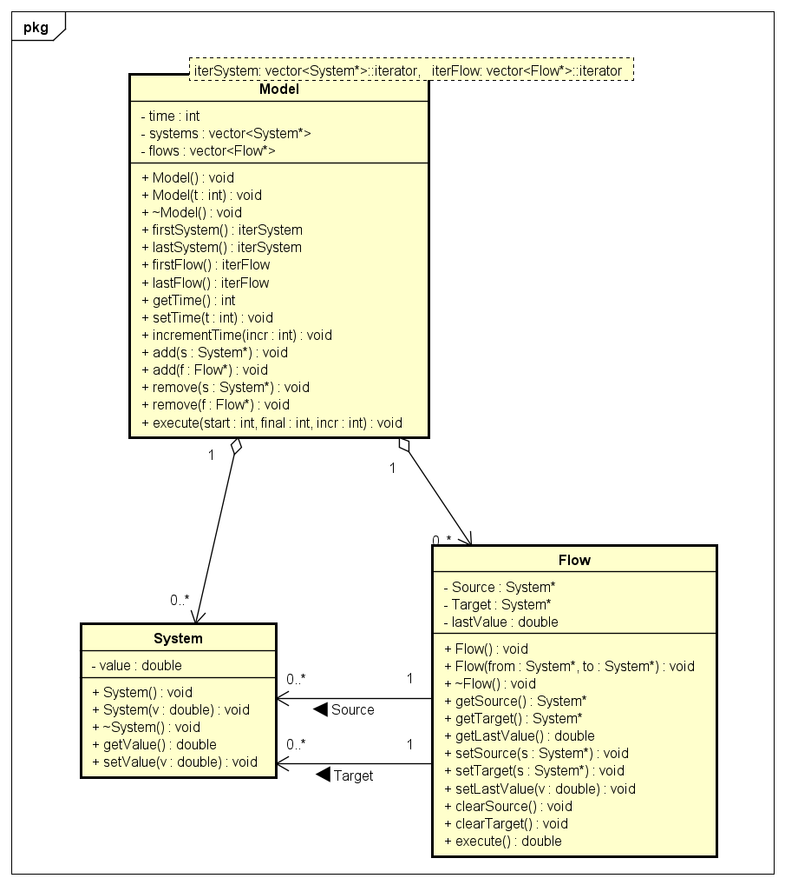

**<div align="center">Universidade Federal de Ouro Preto</div>**

<div align="center">Programa de Pós-Graduação em Ciência da Computação</div>

**<div align="center">PCC108 - Engenharia de Software</div>**

# Projeto MyVensim

Este documento é parte da entrega da *Sprint 1*, fornecida em cronograma definido junto ao cliente.

O projeto objetiva a construção de um software para a criação de modelos de fluxos populacionais.

## 1.1 Casos de Uso

1. Criar modelo;
2. Adicionar fluxo ou sistema a um modelo;
3. Remover fluxo ou sistema a um modelo;
4. Executar modelo;
5. Criar sistema;
6. Instanciar ou alterar estoque do silstema;
7. Criar fluxo;
8. Integrar sistema de origem e de destino do fluxo;
9. Permitir a execução de fluxos considerando tipos distintos de equações algébricas. A execução desses fluxos consiste na transferência de estoque entre o sistema de origem e o sistema de destino.

## 1.2 Critérios de Aceitação

Os critérios de aceitação foram fornecidos em arquivo modelo de extensão *'.mdl'*, enviado pelo cliente.

O arquivo modelo deve ser executado no software Vensim ® PLE. A partir da execução, é possível verificar a existência de modelos de fluxo.

1. Modelo *exponencial*;
2. Modelo *logistica*; e
3. Modelo *complexo*.

A execução dos modelos obtém resultados de saída. Os modelos criados no software a ser desenvolvido devem obter aqueles mesmos resultados a partir de entradas e equações idênticas ao fornecido no arquivo modelo.

## 2. Validação do Cliente

Os casos de uso e os critérios de aceitação foram validados com o cliente no encontro do dia 12 de abril de 2022, com gravação disponível no link https://drive.google.com/file/d/1Zdt_LdYFIA6VpEtfMe9LOBGv-2HJcKP4/view.

## 3. Projeto de API

### Casos de Uso

#### 1. Criar modelo:

```
Model* m;
```

#### 2. Adicionar fluxo ou sistema a um modelo:

```
Model.add(System* s);
Model.add(Flow* f);
```

#### 3. Remover fluxo ou sistema a um modelo:

```
m.remove(System* s);
m.remove(Flow* f);
```

#### 4. Executar modelo:

```
m.execute();
```

#### 5. Criar sistemas:

```
System* s1;
System* s2;
```

#### 6. Instanciar ou alterar estoque do sistema:

```
double v1;
s1.setValue(v1);

double v2;
s2.setValue(v2);
```

#### 7. Criar fluxo:

```
Flow *f;
```

#### 8. Integrar sistema de origem e de destino do fluxo:

```
f.setSource(s1);
f.setSource(s2);
```

#### 9. Permitir a execução de fluxos considerando tipos distintos de equações algébricas:

```
f.execute();
```

### Cenários de Teste

#### 1. Modelo *exponencial*:

```
Model* m;

System* pop1, pop2;
pop1.setValue(100);
pop2.setValue(0);

Flow* exponencial;
exponencial.setSource(pop1);
exponencial.setTarget(pop2);

m.add(pop1);
m.add(pop2);
m.add(exponencial);

m.execute();
```

#### 2. Modelo *logistica*:

```
Model* m;

System* p1, p2;
p1.setValue(100);
p2.setValue(10);

Flow* logistica;
logistica.setSource(p1);
logistica.setTarget(p2);

m.add(p1);
m.add(p2);
m.add(logistica);

m.execute();
```

#### 3. Modelo *complexo*:

```
Model* m;

System* Q1, Q2, Q3, Q4, Q5;
Q1.setValue(100);
Q2.setValue(0);
Q3.setValue(100);
Q4.setValue(0);
Q5.setValue(0);

Flow* f, g, r, t, u, v;

f.setSource(Q1);
f.setTarget(Q2);

g.setSource(Q1);
g.setTarget(Q3);

r.setSource(Q2);
r.setTarget(Q5);

t.setSource(Q2);
t.setTarget(Q3);

u.setSource(Q3);
u.setTarget(Q4);

v.setSource(Q4);
v.setTarget(Q1);

m.add(Q1);
m.add(Q2);
m.add(Q3);
m.add(Q4);
m.add(Q5);

m.add(f);
m.add(g);
m.add(r);
m.add(t);
m.add(u);
m.add(v);

m.execute();
```

### Diagrama de Classes


